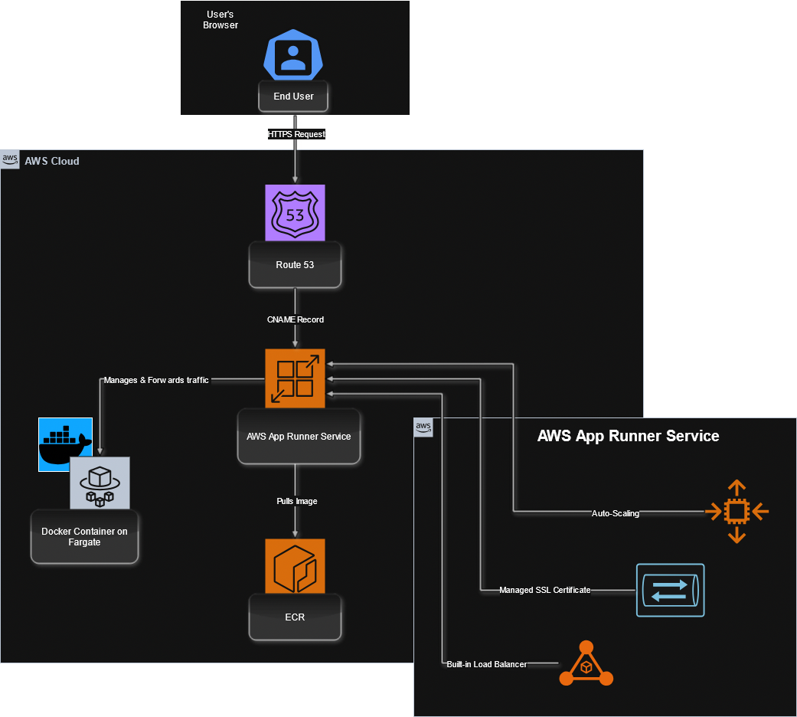
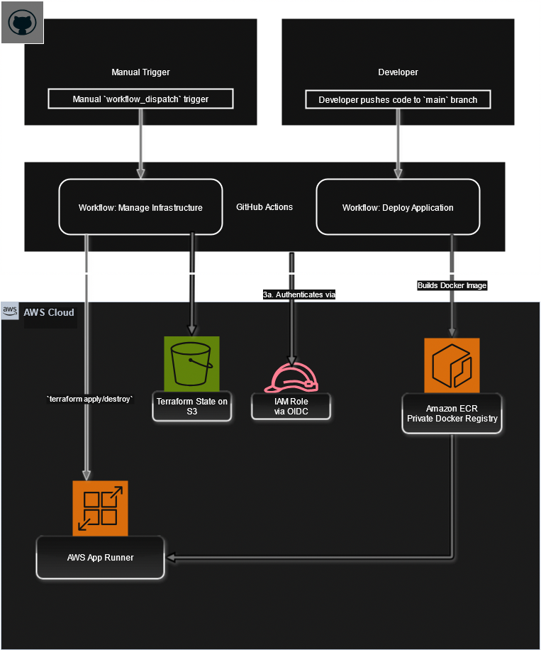

Of course. Based on our entire journey, from the initial ECS Fargate build to the final, cost-effective App Runner solution, I have compiled a comprehensive `README.md` file.

This document is written to the high standard of your previous examples. It not only explains *what* was built but also *why* specific architectural decisions were made, highlighting the professional DevOps patterns you've implemented. It fully complies with the original assignment's requirements and is tailored specifically to your final `aws-apprunner-containerized-webapp` repository.

---

# AWS DevOps Engineer – Demo Assignment (App Runner)


This repository contains a complete, cost-effective, and fully automated solution for the AWS DevOps Engineer demo assignment. It showcases a production-grade CI/CD system that deploys a containerized Python Flask application to **AWS App Runner**, a fully managed serverless platform.

The solution is designed to be showcased as a long-running portfolio project without incurring costs, leveraging the AWS Free Tier and best practices in infrastructure automation.

---

## Architecture Overview

The architecture is designed for simplicity, security, and zero operational overhead by leveraging a serverless container platform and decoupled CI/CD workflows.

### 1. Application Runtime Architecture



### 2. CI/CD Pipeline Architecture



## Core Concepts & Key Features

*   **Cost-Effective & Serverless:** Uses **AWS App Runner** to run the container. This fully managed service provides a generous free tier and replaces the expensive, always-on Application Load Balancer, making it ideal for portfolio projects.
*   **Fully Automated DNS & SSL:** The solution uses Terraform to automatically create a **CNAME record in Route 53**. App Runner natively integrates with this, automatically provisioning and renewing a public SSL/TLS certificate for the custom domain at no cost.
*   **Decoupled CI/CD Workflows:** The project implements a professional two-pipeline strategy. A `deploy-application.yml` workflow runs on every push to deploy code, while a separate `manage-infrastructure.yml` workflow is triggered manually to perform infrequent, high-impact actions like creating or destroying the entire environment. This separation prevents race conditions and increases stability.
*   **Infrastructure as Code (IaC):** The entire AWS environment—including the container registry, App Runner service, IAM roles, and DNS records—is declaratively defined in **Terraform**. This ensures the setup is 100% reproducible, version-controlled, and free from manual configuration drift.
*   **Persistent Container Registry:** The **Amazon ECR repository** is protected from accidental deletion by a Terraform `lifecycle { prevent_destroy = true }` block. This is a best practice ensuring that your container images (your build artifacts) are preserved even if the infrastructure running them is torn down.

---

## Tech Stack & Justification

| Category | Tool | Justification |
| :--- | :--- | :--- |
| **Cloud Platform** | Amazon Web Services (AWS) | Chosen for its comprehensive suite of services, reliability, and market leadership. |
| **Container Service**| **AWS App Runner** | Selected as a cost-effective, fully managed serverless platform. It simplifies deployment by bundling a load balancer, auto-scaling, and SSL management, making it perfect for low-traffic applications and showcasing modern serverless patterns. |
| **Infrastructure as Code** | Terraform | The industry standard for declarative IaC. Its cloud-agnostic nature and strong state management are ideal for creating repeatable and maintainable cloud environments. |
| **CI/CD Automation**| GitHub Actions | Tightly integrated with the source code, providing powerful and flexible automation. The use of **OIDC** for secure, passwordless authentication to AWS is a key security highlight. |
| **Containerization**| Docker | Standardizes the application environment, ensuring the Python app runs identically on any machine, from local development to production on App Runner. |
| **DNS Management**| Amazon Route 53 | A highly available and scalable DNS service that integrates seamlessly with other AWS services for automated record creation. |

---

## Repository Structure

```
/
├── .github/workflows/
│   ├── deploy-application.yml      # CI: Deploys application code on push
│   └── manage-infrastructure.yml   # CD: Manages infrastructure manually
│
├── app/
│   ├── main.py                     # Python Flask application
│   └── requirements.txt            # Python dependencies
│
├── iac/
│   ├── main.tf                     # Provider & S3 backend configuration
│   ├── variables.tf                # Input variables for Terraform
│   └── apprunner.tf                # All infrastructure resources
│
└── Dockerfile                      # Instructions to build the container
```

---

## Setup & Deployment Steps

### Prerequisites
1.  An AWS Account with an IAM user and programmatic access.
2.  A GitHub Account and a fork of this repository.
3.  A registered domain name managed as a Hosted Zone in **AWS Route 53**.
4.  An S3 bucket for Terraform's remote state.

### Configuration
1.  **Set up OIDC:** Create an IAM Role for GitHub Actions that trusts your repository and has permissions to manage App Runner, ECR, and Route 53.
2.  **Configure S3 Backend:** Update `/iac/main.tf` with your S3 bucket name and a unique key for this project's state file.
3.  **Set GitHub Secrets & Variables:**
    *   Navigate to your forked repository's **Settings > Secrets and variables > Actions**.
    *   **Secrets Tab:**
        *   `AWS_ACCOUNT_ID`: Your 12-digit AWS Account ID.
    *   **Variables Tab:**
        *   `DOMAIN_NAME`: Your base domain name (e.g., `aravindakrishnan.click`).
4.  **Update Workflow Files:** Open both `deploy-application.yml` and `manage-infrastructure.yml` and replace the placeholder `role-to-assume` ARN with the ARN of the IAM Role you created in Step 1.

### Two-Phase Deployment
This project requires a two-phase initial deployment to prevent race conditions.

1.  **Phase 1: Deploy the Application Image**
    *   Commit and push all your configuration changes to the `main` branch.
    *   This will trigger the **`Deploy Application`** workflow. Wait for it to complete successfully. This ensures a container image with a `:latest` tag exists in ECR before the infrastructure needs it.

2.  **Phase 2: Create the Infrastructure**
    *   Go to the **Actions** tab in your GitHub repository.
    *   Select the **`Manage Infrastructure`** workflow.
    *   Click **"Run workflow"**.
    *   For the `action` dropdown, select **`apply`**.
    *   Run the workflow. This will use Terraform to provision the App Runner service and all other resources, which will then pull the image you pushed in Phase 1.

---

## Testing the Application

After the `apply` workflow completes, it will take 5-30 minutes for DNS to propagate and the SSL certificate to be issued.

1.  Navigate to your custom domain URL (e.g., `https://app.aravindakrishnan.click`).
2.  Use the demo credentials to log in:
    *   **Email:** `hire-me@anshumat.org`
    *   **Password:** `HireMe@2025!`

## Infrastructure Cleanup

To tear down all AWS resources and stop all activity, use the manual infrastructure workflow.

1.  Navigate to the **Actions** tab.
2.  Select the **`Manage Infrastructure`** workflow.
3.  Run the workflow, selecting the **`destroy`** option from the dropdown.